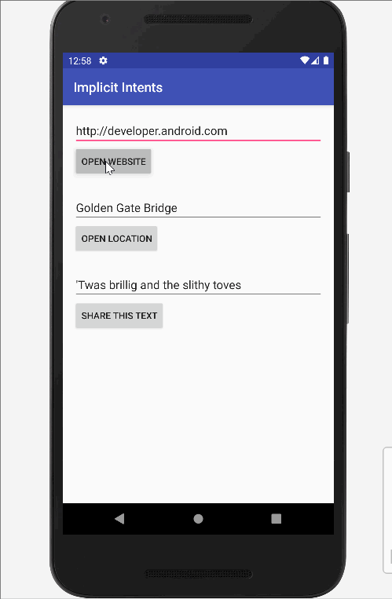

# TodoApp
First, click the add button on the buttom right side of the page and you can see add option where you can keep a reminder of a task of anything you want. after you add you can also double click the task to update or delete the task. And lastly, there is also a delete all option in the top right side as an option incase you want to delete all the task.

